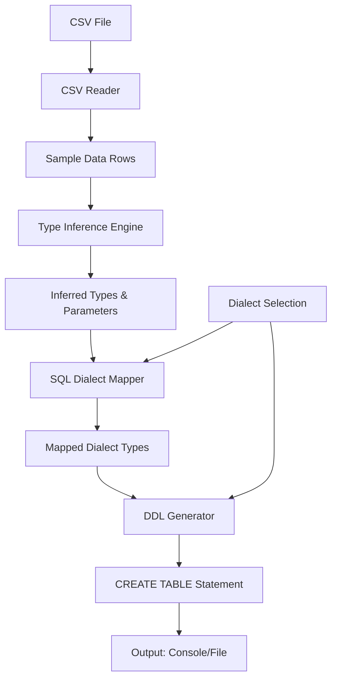

# CSV to Snowflake DDL Converter - Architecture Document

## System Overview
The CSV to Snowflake DDL Converter is a modular Python application that processes CSV files to generate optimized Snowflake CREATE TABLE statements. The system is designed for external execution while maintaining compatibility for future Snowflake Python stored procedure integration.

## Architecture Principles
- **Modularity**: Separated concerns into distinct modules for maintainability
- **Extensibility**: Easy to add new data types, sampling strategies, and output formats
- **Performance**: Efficient data sampling and processing for large files
- **Error Resilience**: Graceful handling of various CSV formats and data quality issues

## Component Architecture

### Core Modules

#### 1. File Reader (`file_reader.py`)
**Responsibilities:**
- Auto-detect file type based on extension (.csv, .xlsx)
- Read CSV files with configurable parameters (delimiter, encoding)
- Read Excel files with sheet selection
- Validate file existence and accessibility
- Extract column headers for downstream processing

**Key APIs:**
- `FileReader.detect_file_type()` distinguishes between CSV and Excel inputs.
- `FileReader.read_file()` orchestrates file loading, clamps sample sizes, and delegates to `_read_csv` or `_read_excel` static helpers.
- `_validate_column_count()` enforces column limits before inference.

#### 2. Type Inference Engine (`type_inference.py`)
**Responsibilities:**
- Analyze sampled data to determine optimal data types
- Handle type precedence (e.g., mixed numeric/string columns)
- Calculate type parameters (length, precision, scale)
- Provide confidence scores for type decisions

**Key Components:**
- `TypeInferrer`: Main inference engine coordinating numeric, date, and string analysis within helper methods.
- `_analyze_numeric`, `_is_date_column`, and `_analyze_string` provide focused heuristics for each data family.

#### 3. SQL Dialect Mapper (`dialect_mapper.py`)
**Responsibilities:**
- Map inferred types to SQL dialect-specific data types
- Support multiple dialects (Snowflake, SQLite, etc.)
- Apply dialect-specific optimizations and constraints
- Handle type conversion rules per dialect

**Key Features:**
- Dialect registry system
- Type mapping dictionaries per dialect
- Constraint validation
- Optimization rules (e.g., VARCHAR vs TEXT)

#### 4. DDL Generator (`ddl_generator.py`)
**Responsibilities:**
- Construct valid Snowflake CREATE TABLE statements
- Format column definitions with appropriate types and constraints
- Generate table options and metadata

**Key APIs:**
- `DDLGenerator.generate_ddl()` assembles the full CREATE TABLE statement from inferred column type metadata.
- `_sanitize_identifier()` normalizes table and column names for SQL compatibility.
- `_avoid_reserved_word()` consults dialect-aware reserved-word sets (e.g., Snowflake vs SQLite) and appends suffixes when conflicts occur.
- `_make_unique_identifier()` avoids collisions after sanitization by appending numeric suffixes when needed.

### Main Application (`csv2ddl.py`)
**Responsibilities:**
- Orchestrate the conversion process
- Handle command-line arguments
- Manage error handling and logging
- Output DDL to console or file

## Data Flow



## Data Structures

### Type Inference Results
```python
{
    "column_name": {
        "inferred_type": "string|numeric|date",
        "snowflake_type": "VARCHAR(100)|NUMBER(10,2)|DATE",
        "parameters": {
            "max_length": 100,
            "precision": 10,
            "scale": 2
        },
        "confidence": 0.95
    }
}
```

### DDL Output Format
**Snowflake Example:**
```sql
CREATE TABLE my_table (
    id NUMBER(10, 0),
    name VARCHAR(255),
    created_date DATE,
    revenue NUMBER(12, 2)
);
```

**SQLite Example:**
```sql
CREATE TABLE my_table (
    id INTEGER,
    name TEXT,
    created_date TEXT,
    revenue REAL
);
```

## Dependencies

### Core Dependencies
- `pandas`: Data manipulation and file reading
- `python-dateutil`: Date parsing and validation
- `chardet`: Encoding detection
- `openpyxl`: Excel file support

### Optional Dependencies
- `pytest`: Unit testing

## SQL Dialect Support

### Supported Dialects
- **Snowflake**: Full support with NUMBER, VARCHAR, DATE/TIMESTAMP types
- **SQLite**: Support with INTEGER, REAL, TEXT types
- **Extensible**: Plugin architecture for adding new dialects

### Dialect Configuration
Each dialect defines:
- Type mapping rules
- DDL syntax variations
- Optimization strategies
- Constraint handling

## Configuration

### Sampling Configuration
- `sample_size`: Number of rows to analyze (default: 1000)
- `sampling_method`: "first_n" or "random" (default: "first_n")

### Type Inference Configuration
- `date_formats`: List of accepted date formats
- `numeric_threshold`: Minimum ratio for numeric type assignment
- `string_padding`: Additional padding for VARCHAR lengths

### Dialect Configuration
- `default_dialect`: Default SQL dialect (default: "snowflake")
- `dialect_options`: Dialect-specific settings

## Error Handling

### Error Types
- `FileNotFoundError`: CSV file not accessible
- `EncodingError`: Unsupported file encoding
- `TypeInferenceError`: Unable to determine column types
- `DDLGenerationError`: Invalid DDL construction

### Recovery Strategies
- Fallback to VARCHAR for uncertain types
- Skip problematic columns with warnings
- Provide detailed error messages with suggestions

## Performance Considerations

### Memory Management
- Streaming CSV reading for large files
- Configurable sampling to limit memory usage
- Garbage collection hints for large datasets

### Processing Optimization
- Parallel type inference for multiple columns
- Caching of common type patterns
- Early termination for homogeneous columns

## Future Extensions

### Snowflake Stored Procedure Integration
- Modular design allows wrapping in Snowflake UDF
- Minimal external dependencies for SP compatibility
- Configuration via SP parameters

### Advanced Features
- Schema evolution detection
- Data quality reporting
- Custom type mapping rules
- Batch processing capabilities

## Security Considerations
- No database connections in external mode
- Input validation for file paths
- Safe handling of potentially malicious CSV content
- No execution of generated DDL in external mode
